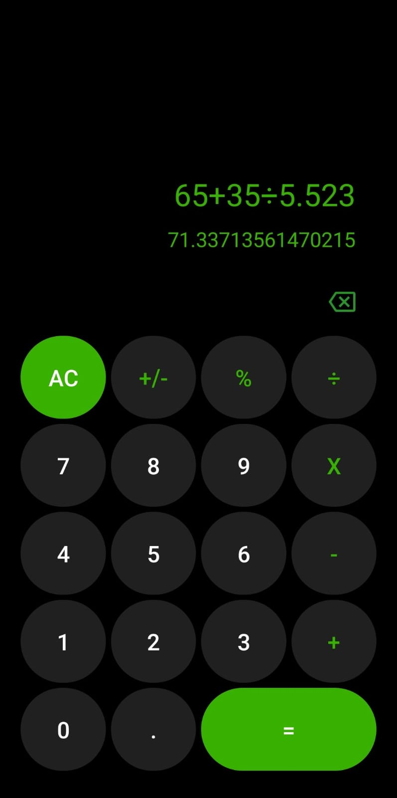

# 📱 Calculadora Android

Calculadora mobile com operações básicas desenvolvida em Kotlin, durante a prática do programa Jovem Aprendiz de desenvolvedor Android.

### 👀 Pré-visualização:

### 🧐 Arquivos principais:

[Main Activity](app/src/main/java/com/example/calculadora/Main.kt)

[XML da Main Activity](app/src/main/res/layout/mainlayout.xml)
